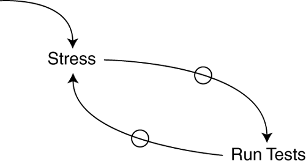

# Better Testing Course
> or How I Learned to Stop Worrying and Love the Tests

> 
> 
> "No time for testing" loop

# References

* Test-Driven Development By Example, 2nd ed. by Kent Beck
* [Jest Testing Library](https://jestjs.io/docs/en/getting-started)
