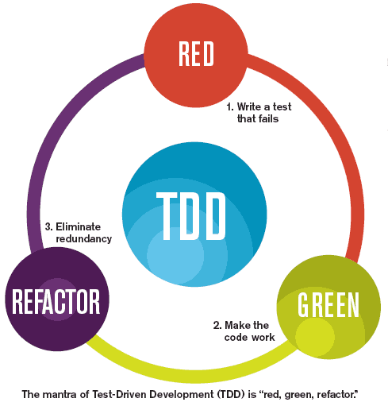

#Red-green-refactor

* Red — think about what you want to test
* Green — think about how to make your tests pass
* Refactor — think about how to improve your existing implementation. Think not only in refactor of code, but for the 
test perspective also
