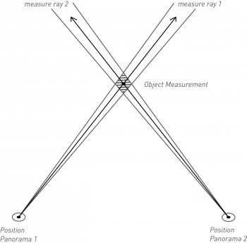

# Triangulation 

- Write down the obvious aspects of tested functionality
- Implement a simple test and make it pass
- Take the next aspect and jump to step#2
- Try to think about more aspects. If you find one, jump to step#2

